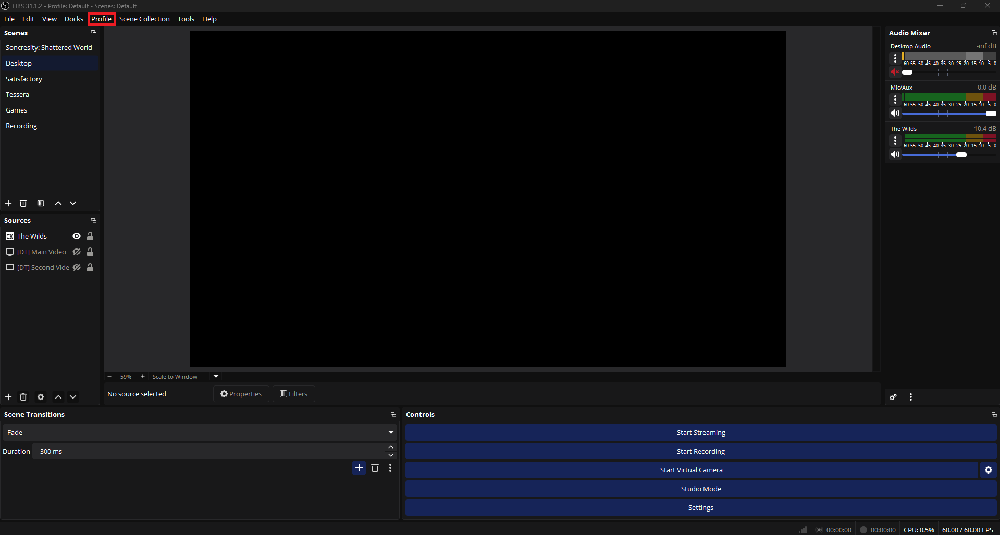
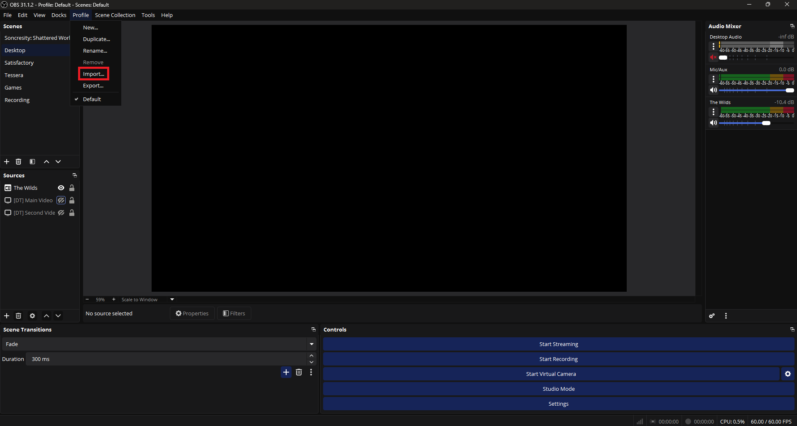
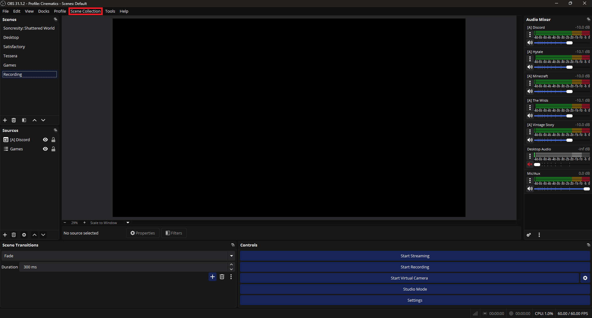
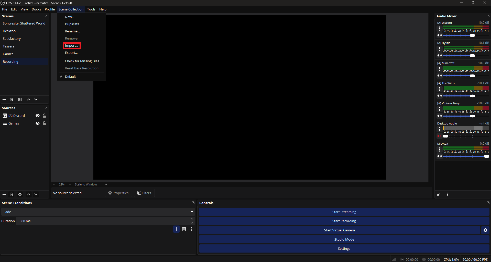
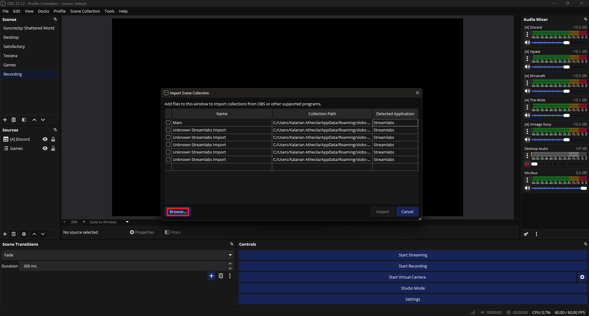

# Soncresity Industries OBS Cinematics alternate profile setup

## What is this setup?

This is the official setup for the OBS Desktop application used in recordings on the Soncresity Industries YouTube channel. This is mandatory for recording with Soncresity Industries!

## Importing the settings profile

To import the settings profile, open your OBS Studio and click on the **Profile** dropdown in the top bar.

Next, select **Import...** and choose `./Cinematics/` from the root of this repository.

## Importing the scene collection

To import the scene collection, open your OBS Studio and click on the **Scene Collection** dropdown in the top bar.

Next, select **Import...**.

If you never did this before, OBS will ask you if it should import automatically in the future and you should press **Yes** here. After that, click **Browse...** and select `./Cinematics.json` from the root of this repository.

